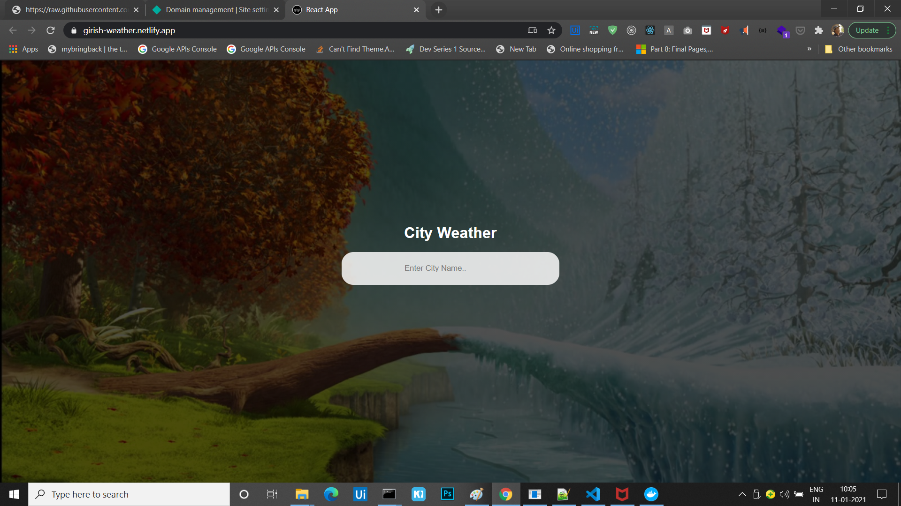

# Weather Progressive Web Application


### [Live Site](https://girish-weather.netlify.app/)

## Introduction
This is a code repository for react Weather app.You can enter the City name and app will
display current weather of the city.

Setup:
- run ```npm i && npm start``` for both client and server side to start the development server